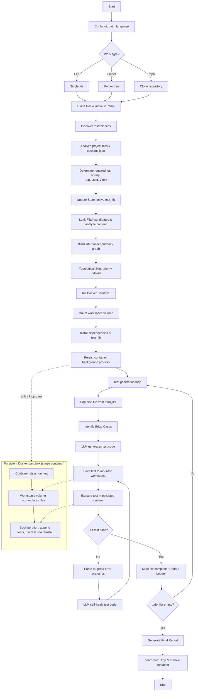

## Project Overview: Autonomous QA Agent

The **QA Agent** is an AI-driven testing pipeline that autonomously generates, executes, and self-heals unit tests for JavaScript and TypeScript projects.

Built as a **LangGraph state machine**, the agent systematically ingests a codebase, determines the optimal testing strategy, writes tests using an LLM, and safely executes them inside a **single persistent Docker sandbox**. If a test fails, the agent feeds the error logs back to the LLM to self-heal the code until it passes.

### Core Design Principles

| Principle | Description |
| --- | --- |
| **Persistent Docker Sandbox** | A single container is provisioned at the start and kept alive until teardown. Heavy operations like `npm install` run **once**, saving massive amounts of time. |
| **Append, Do Not Recreate** | Newly generated test files (and required source code) are continuously **written into the mounted workspace** inside the active container. |
| **Dependency-Aware Planning** | The LLM maps out internal dependencies and performs a topological sort, ensuring foundational files are tested before the complex files that rely on them. |
| **Iterative Self-Healing** | On failure, the agent parses the exact terminal errors and sends a focused error report back to the LLM to fix the test. This retry loop continues until success or `max_retries` is reached. |

---

### Workflow Architecture (The 6 Phases)

#### Phase 1: Ingestion & Discovery

* The CLI accepts a target path (a single file, a local folder, or a Git repository URL) and project language.
* The agent clones the files into a `.temp` workspace and scans the directory, automatically excluding build artifacts, `node_modules`, and existing tests.

#### Phase 2: Project Analysis

* An LLM strictly analyzes the project configuration files (like `package.json` or `tsconfig.json`).
* It determines the required testing framework (Jest, Vitest, Mocha, etc.), the module system (ESM vs. CommonJS), and the necessary installation commands.

#### Phase 3: Intelligent Planning

* The LLM filters out non-testable files (e.g., pure interfaces or basic exports).
* It maps the internal imports of the remaining files to build a **dependency graph**.
* Files are sorted into a priority **todo list** so zero-dependency modules are tested first.

#### Phase 4: Sandbox Initialization

* The agent spins up **one** Docker container (`node:20-alpine`) and mounts the temporary QA workspace.
* It writes the language-specific test configurations and runs `npm install` to prepare the environment.

#### Phase 5: The Worker Loop (Execution & Self-Healing)

* **Select:** Pops the next file from the priority todo list.
* **Identify:** An LLM reviews the source code to map out required happy paths and edge cases.
* **Generate:** The LLM drafts the test file, strictly adhering to the planned edge cases and calculated import paths.
* **Execute:** The test is saved to the workspace and executed via the persistent Docker container.
* **Self-Heal:** If the test fails, the terminal output is parsed for specific errors and fed back to the generator to fix the code.

#### Phase 6: Finalization

* **Report:** A final summary is compiled detailing pass/fail rates, retries used, and total token consumption.
* **Teardown:** The Docker container is safely stopped and removed.

---

### Project Folder Structure

```text
qa-agents/
├── docs/                     # Project documentation and rulebooks
├── examples/                 # Dummy projects/files used to test the agent locally
├── script/                   # Internal development and utility scripts
├── pyproject.toml            # Python dependencies (uv/pip)
├── README.md                 
└── src/                      # Core Application Code
    ├── constants/            # Configuration-driven settings (NO business logic)
    │   └── languages/
    │       ├── __init__.py
    │       ├── config.py
    │       ├── javascript.py
    │       └── typescript.py
    ├── middleware/           # LangChain interceptors and loggers
    │   ├── __init__.py
    │   └── logger.py
    ├── utils/                # Reusable standalone helpers
    │   ├── __init__.py
    │   ├── hitl.py           # Human-in-the-loop prompts
    │   ├── llm.py            # Model instantiation (Docker/Gemini)
    │   ├── sandbox.py        # Persistent Docker execution logic
    │   └── paths.py          # CLI path resolution & validation
    ├── workflow/             # The LangGraph State Machine (The Brain)
    │   ├── __init__.py
    │   ├── state.py          # Defines QAState, Todo Lists, and Dependency Graph
    │   ├── graph.py          # Wires the nodes and conditional edges together
    │   └── nodes/            # Single-responsibility execution steps
    │       ├── __init__.py
    │       ├── clone_files.py         # Phase 1: Ingests files/repos
    │       ├── discover_files.py      # Phase 1: Filters target source code
    │       ├── analyze_project.py     # Phase 2: Detects frameworks & configs
    │       ├── plan_strategy.py       # Phase 3: Sorts dependencies & builds Todo list
    │       ├── setup_sandbox.py       # Phase 4: Starts persistent container
    │       ├── select_next_file.py    # Phase 5: Pops next file from Todo list
    │       ├── identify_edge_cases.py # Phase 5: Maps test scenarios
    │       ├── generate_test.py       # Phase 5: LLM writes/fixes the test
    │       ├── execute_test.py        # Phase 5: Runs test in Docker & parses errors
    │       ├── generate_report.py     # Phase 6: Compiles final run stats
    │       └── teardown.py            # Phase 6: Kills the sandbox
    └── main.py               # CLI Entry Point (Typer/Rich)

```

---

### Visual Workflow Graph

The diagram below maps the execution flow of the LangGraph state machine. Notice how the Worker Loop continuously utilizes the **same** long-lived Docker sandbox without needing to reinstall dependencies.

