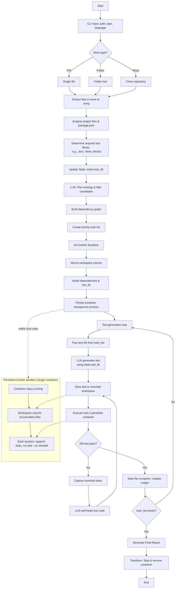

## Project Overview: Autonomous QA Agent

The **QA Agent** is an AI-driven testing pipeline that autonomously generates, executes, and self-heals unit tests for JavaScript and TypeScript projects.

It runs as a **LangGraph state machine**: discover files, plan test order, generate Jest tests with an LLM, and execute them inside a **single persistent Docker sandbox** for the whole run.

### Core design ideas

| Idea | What it means |
|------|----------------|
| **Persistent Docker sandbox** | One container is created at the start, kept alive until teardown. `npm install` runs **once**, not per file. |
| **Append, do not recreate** | Each new test (and supporting sources) is **written into the mounted workspace** inside that container. Jest runs **in the same container** so earlier tests and modules remain available. |
| **Dependency-aware planning** | The LLM builds a todo list so foundational files are tested before files that import them. |
| **Self-healing** | On failure, stderr is sent back to the LLM to fix the test; retries continue until pass or `max_retries`. |

---

### Workflow architecture (four phases)

#### Phase 1: Environment initialization

- Start **one** Docker container and mount a QA workspace (`src/`, `tests/`, `package.json`, Jest config).
- Run **`npm install` once** in that container.
- Keep the container **running** for the entire workflow (no new container per test file).

#### Phase 2: Ingestion and extraction

- CLI collects target path (file, folder, or repo) and project language (**JavaScript** or **TypeScript**).
- **Extract** traverses the tree, applies exclude rules, and fills `discovered_files` in state.

#### Phase 3: Intelligent planning

- LLM filters non-testable files (types-only, config, and similar).
- Builds a **dependency graph** and a priority **todo list**.

#### Phase 4: Execution and self-healing (inside the same container)

- **Generate** a Jest test for the next file in the todo list.
- **Append** the test file (and any needed artifacts) to the **existing** workspace volume; do not spin up a new sandbox.
- **Run** `jest` in the **persisted** container.
- On failure: capture terminal output, retry with the LLM until pass or limit.
- On success: record result, continue to the next file.
- **Teardown:** stop and remove the container when the run finishes.

---

### Project folder structure

```text
qa-agents/
├── docs/                     # Project documentation and rulebooks
├── examples/                 # Dummy projects/files used to test the agent locally
├── script/                   # Internal development and utility scripts
├── pyproject.toml            # Python dependencies (uv/pip)
├── README.md                 
└── src/                      # Core Application Code
    ├── constants/            # Configuration-driven settings (NO business logic)
    │   └── languages/
    │       ├── __init__.py
    │       ├── config.py
    │       ├── javascript.py
    │       └── typescript.py
    ├── middleware/           # LangChain interceptors and loggers
    │   ├── __init__.py
    │   └── logger.py
    ├── utils/                # Reusable standalone helpers
    │   ├── __init__.py
    │   ├── hitl.py           # Human-in-the-loop prompts
    │   ├── llm.py            # Model instantiation (Docker/Gemini)
    │   ├── sandbox.py        # Persistent Docker execution logic
    │   └── paths.py          # CLI path resolution & validation
    ├── workflow/             # The LangGraph State Machine (The Brain)
    │   ├── __init__.py
    │   ├── state.py          # Defines QAState, Todo Lists, and Dependency Graph
    │   ├── graph.py          # Wires the nodes and conditional edges together
    │   └── nodes/            # Single-responsibility execution steps
    │       ├── __init__.py
    │       ├── init_docker.py     # Starts persistent container
    │       ├── extract_files.py   # Gathers files from CLI path
    │       ├── plan_strategy.py   # LLM sorts dependencies & builds Todo list
    │       ├── select_next.py     # Pops next file from Todo list
    │       ├── generate_test.py   # LLM writes the Jest test
    │       └── run_test.py        # Appends test to Docker and runs it
    └── main.py               # CLI Entry Point (Typer/Rich)
```
See [docs/nodes-and-tools.md](docs/nodes-and-tools.md) for implementation status and build levels, and [docs/nodes.md](docs/nodes.md) for detailed node specifications.

---

### Visual workflow graph

The diagram below shows **one long-lived Docker sandbox**. After initialization, every test cycle **appends** files to that environment and **reuses** the same container to run Jest.



**How to read the sandbox subgraph:** from `Persist container` through every file in the todo loop, all work happens in **one** Docker process. New tests are **appended** to the workspace; the agent does **not** create a fresh container or run `npm install` again for each file.

---

### Implementation note

The repository is being built level by level. Today the graph includes **file discovery** (`extract_files`); planning, persistent sandbox nodes, and the full test loop are defined in the docs and added incrementally. The architecture above is the **target** behavior described in [docs/rule.md](docs/rule.md).
