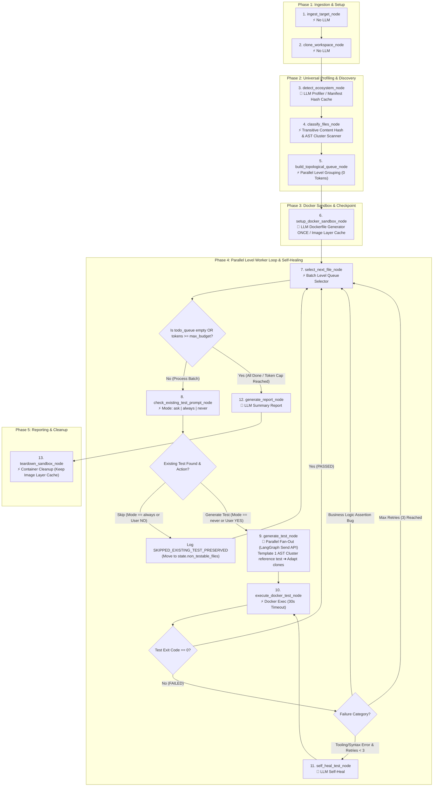

# LangGraph Nodes & Control Flow Specification

This specification documents every node, state transition, and state update payload in the **LangGraph QA Agent State Machine**.

### System Documentation Index:

- 📖 [System Architecture & Workflow Specification](file:///c:/Users/Pawan/Desktop/FullStackProject/qa-agents/docs/QA_AGENT_FLOW.md)
- ⚙️ [LangGraph 13-Node Technical Specification](file:///c:/Users/Pawan/Desktop/FullStackProject/qa-agents/docs/LANGGRAPH_NODES_SPEC.md)
- 📁 [Project Codebase Structure & Installed Dependencies Guide](file:///c:/Users/Pawan/Desktop/FullStackProject/qa-agents/docs/PROJECT_STRUCTURE.md)

---

## 1. Complete LangGraph Architecture Diagram



---

## 2. Formal LangGraph State Schema (`QAState`)

The agent's state machine is typed using Python's `TypedDict` (`src/workflow/state.py`):

```python
from typing import TypedDict, List, Dict, Optional, Any

class NonTestableFile(TypedDict):
    source_file: str
    reason: str
    skipped_by: str  # "AST_CHECK" | "SKIPPED_EXISTING_TEST_PRESERVED" | "UNCHANGED_TRANSITIVE_HASH_SKIPPED"

class TestResultFile(TypedDict):
    source_file: str
    test_file: str
    transitive_hash: str # sha256 of source file + imported dependencies
    status: str          # "PASSED" | "FAILED" | "POTENTIAL_APPLICATION_BUG"
    failure_category: Optional[str] # "TOOLING_ERROR" | "BUSINESS_ASSERTION_BUG"
    retries_used: int
    execution_time_ms: int

class QAState(TypedDict):
    run_id: str                              # e.g., "express-8f3a1d"
    target_path: str                         # User input path or URL
    input_mode: str                          # "SINGLE_FILE" | "FOLDER" | "GIT_REPO"
    workspace_dir: str                       # Path to .temp/{name}-{uuid}
    container_id: Optional[str]              # Active Docker container ID
    container_name: Optional[str]            # Named container: qa-agent-{foldername}
    image_name: Optional[str]                # Named image: qa-agent-{foldername}:{manifest_hash}
    manifest_hash: str                       # sha256 checksum of manifest file
    existing_tests_mode: str                 # "ask" | "always" | "never" (Global CLI mode)

    # Universal Ecosystem Profiler Results
    project_language: str                    # "typescript", "python", "go"
    project_type: str                        # "FRONTEND" | "BACKEND_API" | "LIBRARY"
    application_framework: Optional[str]     # "react", "fastapi", "express", "gin"
    manifest_file: Optional[str]             # "package.json", "pyproject.toml", "go.mod"
    import_system: str                       # "COMMONJS" | "ESM" | "PYTHON_RELATIVE" | "PYTHON_ABSOLUTE"
    test_framework: str                      # "jest", "pytest", "testing"
    test_environment: str                    # "jsdom" vs "node" vs "python"
    install_command: str                     # "npm install", "pip install"
    logic_signatures: Dict[str, Any]         # Control flow keywords & AST patterns
    ast_clusters: Dict[str, List[str]]       # Map of master_template_file -> [clone_files]

    # State Lists & Queues
    testable_files: List[str]                # Confirmed files requiring test generation
    non_testable_files: List[NonTestableFile]# Skipped files + audit reasons
    existing_tests_map: Dict[str, str]       # Map of source_file -> existing_test_path
    topological_levels: List[List[str]]      # Grouped parallel execution levels
    completed_files: List[TestResultFile]    # Passed test files
    failed_files: List[TestResultFile]       # Failed test files or application bugs

    # Execution Worker & Guardrails
    current_file_batch: List[str]            # Active parallel file batch for current level
    current_retries: int                     # Retries spent on current file batch
    total_tokens_used: int                   # Cumulative tokens consumed across run
    max_token_budget: int                    # Maximum token budget cap (default 50,000)
    per_test_timeout_sec: int                # Docker test execution timeout (default 30s)
```

---

## 3. Node-by-Node Specification & State Payload Examples

### Node 1: `ingest_target_node` (Interactive Target Ingestion)

- **LLM Usage:** ⚡ **NO LLM (0 Tokens) + Interactive CLI Terminal Service Prompt**
- **State Read:** `target_input` (Optional CLI argument)
- **State Write:** `target_path`, `input_mode`
- **Responsibility (Step-by-Step):**
    1. **Check CLI Arguments:** If `--target` is provided via CLI, validates the target path/URL directly.
    2. **Interactive Selection Menu (if no CLI target provided):** Displays interactive menu powered by `src/services/terminal_service.py`:
        > ? **Select Target Input Mode:**  
        > `[1] Single File` (Generate test for 1 file)  
        > `[2] Folder Path` (Generate tests for full folder/project)  
        > `[3] Git Repository URL` (Clone public repo and generate tests)
    3. **Path Validation & State Storage:** Prompts user for target string, cleans path quotes, validates existence, and updates `QAState` with `input_mode` (`"SINGLE_FILE" | "FOLDER" | "GIT_REPO"`) and resolved `target_path`.
- **State Update Payload Example:**
    ```json
    {
    	"target_path": "c:/Users/Pawan/Desktop/my-express-api",
    	"input_mode": "FOLDER"
    }
    ```

---

### Node 2: `clone_workspace_node`

- **LLM Usage:** ⚡ **NO LLM (0 Tokens)**
- **State Read:** `target_path`, `input_mode`
- **State Write:** `run_id`, `workspace_dir`
- **State Update Payload Example:**
    ```json
    {
    	"run_id": "express-8f3a1d",
    	"workspace_dir": "c:/Users/Pawan/Desktop/FullStackProject/qa-agents/.temp/express-8f3a1d"
    }
    ```

---

### Node 3: `detect_ecosystem_node` (Universal Profiler & Manifest Cache)

- **LLM Usage:** 🤖 **0 Tokens on Cache Hit / ~75 Tokens on Cache Miss**
- **State Read:** `workspace_dir`
- **State Write:** `manifest_hash`, `project_language`, `project_type`, `application_framework`, `manifest_file`, `import_system`, `test_framework`, `test_environment`, `install_command`, `logic_signatures`, `language_rules`
- **Responsibility:**
    1. Inspects manifest (`package.json`, `pyproject.toml`, `go.mod`, `Cargo.toml`, etc.) to generate the ecosystem profile ONCE per project (~75 tokens or 0 tokens on cache hit).
    2. Extracts `logic_signatures` (control flow keywords, framework handlers, DB queries, non-testable patterns) and `language_rules` into `QAState`.
- **State Update Payload Example (Python FastAPI Project):**
    ```json
    {
    	"manifest_hash": "e3b0c44298fc1c149afbf4c8996fb92427ae41e4649b934ca495991b7852b855",
    	"project_language": "python",
    	"project_type": "BACKEND_API",
    	"application_framework": "fastapi",
    	"manifest_file": "pyproject.toml",
    	"import_system": "PYTHON_ABSOLUTE",
    	"test_framework": "pytest",
    	"test_environment": "python",
    	"install_command": "pip install -r requirements.txt",
    	"logic_signatures": {
    		"control_flow_keywords": [
    			"if",
    			"elif",
    			"else",
    			"for",
    			"while",
    			"try",
    			"except",
    			"return",
    			"raise",
    			"with"
    		],
    		"async_and_event_signatures": [
    			"async def",
    			"await",
    			"httpx",
    			"aiohttp",
    			"asyncio"
    		],
    		"framework_handler_signatures": [
    			"@app.get",
    			"@app.post",
    			"@router.get",
    			"APIRouter()",
    			"BaseModel",
    			"Depends"
    		],
    		"database_query_signatures": [
    			"SessionLocal",
    			"db.query",
    			"select(",
    			"filter("
    		],
    		"negative_non_testable_signatures": [
    			"__all__ = ",
    			"settings = ",
    			"pass"
    		]
    	},
    	"language_rules": {
    		"non_testable_extensions": [
    			".pyc",
    			".pyo",
    			".pyd",
    			".png",
    			".env",
    			"__init__.py"
    		]
    	}
    }
    ```

---

### Node 4: `classify_files_node` (Testable vs Non-Testable File Classifier)

- **LLM Usage:** ⚡ **NO LLM (0 Tokens)**
- **State Read:** `workspace_dir`, `language_rules`, `logic_signatures`
- **State Write:** `testable_files`, `non_testable_files`
- **Responsibility:**
    1. Reads `logic_signatures` (`control_flow_keywords`, `async_and_event_signatures`, `framework_handler_signatures`, `database_query_signatures`, `negative_non_testable_signatures`) and `language_rules` from `QAState` (populated by Node 3).
    2. Scans files in `workspace_dir` and checks signature keys.
    3. If a file matches a non-testable extension or negative signature (e.g. `settings = `, `pass`), adds to `state.non_testable_files` with `matched_signature_key`, `skipped_by`, and audit reason.
    4. Otherwise, collects valid code files into `state.testable_files`.
- **State Update Payload Example:**
    ```json
    {
    	"testable_files": [
    		"app/services/payment.py",
    		"app/controllers/checkout.py"
    	],
    	"non_testable_files": [
    		{
    			"source_file": "app/config/settings.py",
    			"reason": "Matched negative non-testable signature (settings = )",
    			"skipped_by": "NEGATIVE_SIGNATURE_CHECK",
    			"matched_signature_key": "negative_non_testable_signatures"
    		}
    	]
    }
    ```

---

### Node 5: `topological_sort_node` (Parallel Level Grouping)

- **LLM Usage:** ⚡ **NO LLM (0 Tokens)**
- **State Read:** `workspace_dir`, `testable_files`
- **State Write:** `topological_levels`
- **Responsibility:**
    1. Analyzes dependency import connections across `state.testable_files`.
    2. Performs topological sorting (e.g. using Python's `graphlib.TopologicalSorter`) to group independent files into parallel execution level batches (`topological_levels`).
    3. Updates `state.topological_levels` in `QAState` for batch consumption by downstream nodes.
- **State Update Payload Example:**
    ```json
    {
    	"topological_levels": [
    		["app/utils/math.py", "app/utils/format.py"],
    		["app/services/payment.py"],
    		["app/controllers/checkout.py"]
    	]
    }
    ```

---

### Node 6: `setup_docker_environment_node` (LLM Dockerfile Generator ONCE & Layer Cache)

- **LLM Usage:** 🤖 **LLM-Powered ONCE per Project / 0 Tokens on Image Cache Hit**
- **State Read:** `workspace_dir`, `manifest_hash`, `manifest_file`, `install_command`
- **State Write:** `container_id`, `container_name`, `image_name`
- **State Update Payload Example:**
    ```json
    {
    	"container_id": "c8f92a41d7e2f5b89a01c3e",
    	"container_name": "qa-agent-express-api",
    	"image_name": "qa-agent-express-api:e3b0c44298fc"
    }
    ```

---

### Node 7: `select_next_file_node` (Batch Queue Selector & Level Resetter)

- **LLM Usage:** ⚡ **NO LLM (0 Tokens)**
- **State Read:** `topological_levels`
- **State Write:** `current_file_batch`, `current_retries`, `topological_levels`
- **Responsibility:** Pops the entire next level array from `topological_levels` into `current_file_batch` (e.g. `["math.py", "format.py"]`) for parallel worker processing.
- **State Update Payload Example:**
    ```json
    {
    	"current_file_batch": ["app/utils/math.py", "app/utils/format.py"],
    	"current_retries": 0
    }
    ```

---

### Node 8: `check_existing_test_prompt_node` (Existing Test Resolver & Mode Router)

- **LLM Usage:** ⚡ **NO LLM (0 Tokens) + Optional User Prompt**
- **State Read:** `workspace_dir`, `current_file_batch`, `existing_tests_mode`
- **State Write:** `non_testable_files`, `existing_tests_map`
- **Responsibility:**
    - Checks `state.existing_tests_mode`:
        - **`"always"` (CI / Unattended Mode Default):** Automatically skips all pre-existing tests without prompting. Moves skipped files to `state.non_testable_files` (`reason: "SKIPPED_EXISTING_TEST_PRESERVED"`). Zero human blocking!
        - **`"never"`:** Automatically overwrites / re-generates test cases under `tests/qa_agent_generated/`.
        - **`"ask"` (Interactive Audit Mode):** Prompts user once per file when an existing test is detected.
- **State Update Payload Example:**
    ```json
    {
    	"non_testable_files": [
    		{
    			"source_file": "app/services/auth.py",
    			"reason": "Existing test file found at tests/test_auth.py (Skipped via existing_tests_mode == always)",
    			"skipped_by": "SKIPPED_EXISTING_TEST_PRESERVED"
    		}
    	]
    }
    ```

---

### Node 9: `generate_test_node` (Parallel Fan-Out & AST Cluster Template Adaptor)

- **LLM Usage:** 🤖 **YES (LLM-Powered via LangGraph Send API Fan-Out)**
- **State Read:** `current_file_batch`, `ast_clusters`, `import_system`, `test_framework`
- **State Write:** `generated_test_code`, `test_file_path`, `total_tokens_used`
- **Responsibility:**
    - **Parallel Fan-Out:** Uses LangGraph `Send()` API to execute worker branches concurrently for all files in `current_file_batch`.
    - **AST Template Adaptation:** Generates 1 full reference test for master AST cluster file (~800 tokens), then uses 50-token micro-prompts to adapt structural clones, saving 80% tokens.
    - Updates cumulative `total_tokens_used`.
- **State Update Payload Example:**
    ```json
    {
    	"test_file_path": "tests/qa_agent_generated/test_payment.py",
    	"generated_test_code": "import pytest\nfrom app.services.payment import process_payment\n\ndef test_process_payment_success():\n    result = process_payment(amount=100)\n    assert result.status == 'SUCCESS'",
    	"total_tokens_used": 1420
    }
    ```

---

### Node 10: `execute_docker_test_node` (Sandbox Executor with Timeout)

- **LLM Usage:** ⚡ **NO LLM (0 Tokens)**
- **State Read:** `container_id`, `test_file_path`, `per_test_timeout_sec`
- **State Write:** `last_exit_code`, `raw_logs`, `completed_files`
- **Responsibility:**
    - Executes test inside container: `docker exec qa-agent-express-api pytest tests/qa_agent_generated/test_payment.py`.
    - Enforces 30-second execution timeout per test to kill infinite loops.
- **State Update Payload Example:**
    ```json
    {
    	"last_exit_code": 0,
    	"raw_logs": "tests/qa_agent_generated/test_payment.py . [100%]\n1 passed in 0.12s\n",
    	"completed_files": [
    		{
    			"source_file": "app/services/payment.py",
    			"test_file": "tests/qa_agent_generated/test_payment.py",
    			"transitive_hash": "a1b2c3d4e5f67890",
    			"status": "PASSED",
    			"retries_used": 0,
    			"execution_time_ms": 120
    		}
    	]
    }
    ```

---

### Node 11: `self_heal_test_node` (Smart Failure Classifier)

- **LLM Usage:** 🤖 **YES (LLM-Powered on Tooling Errors Only)**
- **State Read:** `current_file`, `generated_test_code`, `raw_logs`, `current_retries`
- **State Write:** `generated_test_code`, `current_retries`, `failed_files`, `total_tokens_used`
- **Responsibility:**
    - Analyzes failure log:
        - **Tooling/Syntax Error:** Auto-heals test code (retries up to 3).
        - **Business Logic Assertion Bug:** Marks status as `POTENTIAL_APPLICATION_BUG` and flags for human review without auto-healing.
    - Updates `total_tokens_used`.
- **State Update Payload Example (Detected Bug):**
    ```json
    {
    	"failed_files": [
    		{
    			"source_file": "app/services/payment.py",
    			"test_file": "tests/qa_agent_generated/test_payment.py",
    			"transitive_hash": "a1b2c3d4e5f67890",
    			"status": "POTENTIAL_APPLICATION_BUG",
    			"failure_category": "BUSINESS_ASSERTION_BUG",
    			"retries_used": 0,
    			"execution_time_ms": 150
    		}
    	]
    }
    ```

---

### Node 12: `generate_report_node` (Summary Report & Token Cap Handler)

- **LLM Usage:** 🤖 **YES (Summary Report Generator)**
- **State Read:** `completed_files`, `failed_files`, `non_testable_files`, `total_tokens_used`, `max_token_budget`
- **State Write:** `summary_report`
- **State Update Payload Example:**
    ```json
    {
    	"summary_report": "# Autonomous QA Execution Summary\n- Total Target Files Discovered: 5\n- Tested Files: 3 (3 PASSED, 1 APPLICATION BUG DETECTED)\n- Skipped Non-Testable / Unchanged: 2\n- Total Token Usage: 1,420 / 50,000 max budget\n- Sandbox Container ID: c8f92a41d7e2f5b89a01c3e"
    }
    ```

---

### Node 13: `teardown_sandbox_node` (Container Cleanup & Image Cache Retention)

- **LLM Usage:** ⚡ **NO LLM (0 Tokens)**
- **State Read:** `container_name`, `image_name`
- **State Write:** `container_id`, `status`
- **State Update Payload Example:**
    ```json
    {
    	"container_id": null,
    	"status": "FINISHED"
    }
    ```

---

## 4. LangGraph Conditional Edges Table

| From Node                         | Condition / Edge Function                                   | Target Node                                     |
| --------------------------------- | ----------------------------------------------------------- | ----------------------------------------------- |
| `select_next_file_node`           | `total_tokens_used >= max_token_budget` (Token Cap Reached) | `generate_report_node`                          |
| `select_next_file_node`           | `state.topological_levels` not empty                        | `check_existing_test_prompt_node`               |
| `select_next_file_node`           | `state.topological_levels` empty (Queue finished)           | `generate_report_node`                          |
| `check_existing_test_prompt_node` | User skipped existing test (`NO` or `mode == always`)       | `select_next_file_node` (Loop to next batch)    |
| `check_existing_test_prompt_node` | No existing test OR User said `YES`                         | `generate_test_node` (LangGraph `Send` Fan-Out) |
| `execute_docker_test_node`        | `last_exit_code == 0` (PASS)                                | `select_next_file_node`                         |
| `execute_docker_test_node`        | `Tooling Error` AND `current_retries < 3`                   | `self_heal_test_node`                           |
| `execute_docker_test_node`        | `Business Logic Assertion Bug`                              | `select_next_file_node` (Flag Application Bug)  |
| `execute_docker_test_node`        | `current_retries >= 3` (Max retries reached)                | `select_next_file_node`                         |
