# Autonomous QA Agent - Production System Architecture & Workflow Specification

This document details the complete architectural flow, filtering rules, LLM Dockerfile creation, transitive hash invalidation, parallel LangGraph fan-out, smart self-healing, and token-efficiency guidelines for building the **Autonomous QA Agent**.

### System Documentation Index:
- 📖 [System Architecture & Workflow Specification](file:///c:/Users/Pawan/Desktop/FullStackProject/qa-agents/docs/QA_AGENT_FLOW.md)
- ⚙️ [LangGraph 13-Node Technical Specification](file:///c:/Users/Pawan/Desktop/FullStackProject/qa-agents/docs/LANGGRAPH_NODES_SPEC.md)
- 📁 [Project Codebase Structure & Installed Dependencies Guide](file:///c:/Users/Pawan/Desktop/FullStackProject/qa-agents/docs/PROJECT_STRUCTURE.md)

---

## 1. High-Level Flow Diagram

```mermaid
flowchart TD
    subgraph Phase1["Phase 1: Ingestion & Workspace Setup"]
        A["uv run main.py Trigger"] --> B["Node 1: terminal_service Menu<br/>Select Mode: [1] Single File | [2] Folder | [3] Git URL"]
        B -->|"Single File"| C1["Paste File Path ➔ Copy Target & Manifests"]
        B -->|"Folder Path"| C2["Paste Folder Path ➔ Copy Directory"]
        B -->|"Git Repo URL"| C3["Paste URL ➔ git clone public repo"]
        C1 --> D["Create Sandbox Workspace<br/><code>.temp/{name}-{uuid6}/</code>"]
        C2 --> D
        C3 --> D
    end

    subgraph Phase2["Phase 2: Universal Profiling & Manifest Caching"]
        D --> E{"Manifest Hash Cached?<br/>(sha256 of package.json / pyproject.toml)"}
        E -- "Yes (Cache Hit)" --> F1["Load Ecosystem Profile & Import System<br/>⚡ (0 Tokens / 0ms)"]
        E -- "No (Cache Miss)" --> F2["LLM Micro-Profiler Query (~75 Tokens)<br/>Detect Language, Import System, Test Runner & Rules"]
        F1 --> G["Update QAState Profile"]
        F2 --> G
    end

    subgraph Phase3["Phase 3: Transitive Hash Invalidation & AST Clustering"]
        G --> H["Node 4: classify_files_node<br/>⚡ Transitive Content Hash: sha256(file + imported_deps)<br/>If imported dependency changes ➔ Invalidate & Queue!<br/>Cluster files by AST shape (e.g. 40 CRUD Controllers)"]
        H --> I["Node 5: topological_sort_node<br/>Build Dependency Graph & Group into Parallel Levels"]
        I --> J["Output Topological Levels:<br/>Level 0 (Leaf Utils) ➔ Level 1 (Services) ➔ Level 2 (Controllers)"]
    end

    subgraph Phase4["Phase 4: Persistent Docker Sandbox Setup"]
        J --> K["Node 6: setup_docker_environment_node<br/>Check container & image qa-agent-{foldername}:{hash}"]
        K --> L{"Image Cached?"}
        L -- "Yes" --> M["Spin Up Container instantly (0s build)"]
        L -- "No" --> N["LLM Generates Dockerfile ONCE for Project<br/>Build & Cache Image qa-agent-{foldername}"]
        N --> M
        M --> O["Save Local Checkpoint <code>state.json</code>"]
    end

    subgraph Phase5["Phase 5: Parallel LangGraph Fan-Out Worker Loop"]
        O --> P["Node 7: select_next_file_node<br/>Pop Next Level Batch (current_file_batch)"]
        P --> Q{"Is todo_queue empty OR total_tokens >= max_token_budget?"}
        Q -- "Yes (Done / Token Cap Reached)" --> AF["Node 12: generate_report_node"]
        Q -- "No (Process Batch)" --> R["Node 8: check_existing_test_prompt_node<br/>⚡ Check existing_tests_mode: ask | always | never"]
        
        R --> S{"Existing Test Found?"}
        S -- "Yes AND mode == ask" --> T{"Interactive User Prompt:<br/>File already has test. Generate new test? [y/N]"}
        S -- "Yes AND mode == always" --> U["Move to state.non_testable_files<br/>Reason: SKIPPED_EXISTING_TEST_PRESERVED"]
        T -- "User Says NO" --> U
        U --> P
        T -- "User Says YES" --> V["Node 9: generate_test_node<br/>🤖 Parallel Fan-Out (LangGraph Send API)<br/>Template 1 AST Cluster reference test ➔ Adapt 39 clones"]
        S -- "No Existing Test OR mode == never" --> V
        
        V --> W["Node 10: execute_docker_test_node<br/>Execute batch tests in Docker (30s timeout per test)"]
        W --> X{"Test Exit Code == 0?"}
        X -- "Yes (PASSED)" --> Y["Add to state.completed_files"]
        X -- "No (FAILED)" --> Z{"Analyze Failure Category"}
        Z -- "Tooling/Syntax Error & Retries < 3" --> AA["Node 11: self_heal_test_node<br/>LLM Auto-Heals Test Code"]
        AA --> W
        Z -- "Business Logic Assertion Failure" --> AB["Mark POTENTIAL_APPLICATION_BUG<br/>(Flag for Human Review - Do NOT Auto-Heal)"]
        Z -- "Max Retries (3) Reached" --> AC["Add to state.failed_files"]
        Y --> AD["Update total_tokens_used & Save state.json"]
        AB --> AD
        AC --> AD
        AD --> P
    end

    subgraph Phase6["Phase 6: Reporting & Sandbox Cleanup"]
        AF --> AG["Node 13: teardown_sandbox_node<br/>Remove Docker Container (Keep Image Layer Cache)"]
    end
```



---

## 2. Transitive Dependency Hash Invalidation (Correctness Guarantee)

A major flaw in basic file hashing is that if `mathUtils.py` changes, `paymentService.py` (which imports `mathUtils.py`) appears "unchanged" if only its own content hash is checked.

### Transitive Hash Formula:
Node 4 (`classify_files_node`) computes a **Transitive Content Hash** for every file:

$$\text{TransitiveHash}(F) = \text{sha256}\left(\text{content}(F) + \sum_{D \in \text{imports}(F)} \text{content}(D)\right)$$

* **Result:** If `mathUtils.py` changes, its new hash automatically invalidates `paymentService.py` and `checkoutController.py`, forcing them to be re-tested!
* If neither the file nor any of its imported dependencies changed, the file is skipped safely (`reason: "UNCHANGED_TRANSITIVE_HASH_SKIPPED"`).

---

## 3. AST Structural Clustering (Template 1, Adapt 40)

To exploit structural code repetition across large codebases (e.g. 40 CRUD controllers or 30 DB services):

1. Node 4 computes an **AST Shape Signature** for each testable file.
2. Group files into **Structural Clusters** (e.g., `[UserController, ProductController, CategoryController, OrderController]`).
3. **Template & Adapt Execution:**
   * Node 9 generates **1 Master Reference Test** for `UserController.test.ts` (~800 tokens).
   * For the remaining 39 controllers, Node 9 uses a fast micro-prompt (~50 tokens):
     > *"Adapt `UserController.test.ts` template for `ProductController` (swap User with Product)."*
4. **Token Savings:** Saves **80%+ LLM tokens** across large repositories.

---

## 4. Formal LangGraph State Schema (`QAState`)

The state machine is typed using Python's `TypedDict` (`src/workflow/state.py`):

```python
from typing import TypedDict, List, Dict, Optional, Any

class NonTestableFile(TypedDict):
    source_file: str
    reason: str
    skipped_by: str  # "AST_CHECK" | "SKIPPED_EXISTING_TEST_PRESERVED" | "UNCHANGED_TRANSITIVE_HASH_SKIPPED"

class TestResultFile(TypedDict):
    source_file: str
    test_file: str
    transitive_hash: str # sha256 of file + imported dependencies
    status: str          # "PASSED" | "FAILED" | "POTENTIAL_APPLICATION_BUG"
    failure_category: Optional[str] # "TOOLING_ERROR" | "BUSINESS_ASSERTION_BUG"
    retries_used: int
    execution_time_ms: int

class QAState(TypedDict):
    run_id: str                              # e.g., "express-8f3a1d"
    target_path: str                         # User input path or URL
    input_mode: str                          # "SINGLE_FILE" | "FOLDER" | "GIT_REPO"
    workspace_dir: str                       # Path to .temp/{name}-{uuid}
    container_id: Optional[str]              # Active Docker container ID
    container_name: Optional[str]            # qa-agent-{foldername}
    image_name: Optional[str]                # qa-agent-{foldername}:{manifest_hash}
    manifest_hash: str                       # sha256 checksum of package.json/pyproject.toml
    existing_tests_mode: str                 # "ask" | "always" | "never" (Global CLI mode)
    
    # Universal Ecosystem Profiler Results
    project_language: str                    # "typescript", "python", "go"
    project_type: str                        # "FRONTEND" | "BACKEND_API" | "LIBRARY"
    application_framework: Optional[str]     # "react", "fastapi", "express", "gin"
    manifest_file: Optional[str]             # "package.json", "pyproject.toml", "go.mod"
    import_system: str                       # "COMMONJS" | "ESM" | "PYTHON_RELATIVE" | "PYTHON_ABSOLUTE"
    test_framework: str                      # "jest", "pytest", "testing"
    test_environment: str                    # "jsdom" vs "node" vs "python"
    install_command: str                     # "npm install", "pip install"
    logic_signatures: Dict[str, Any]         # Control flow keywords & AST patterns
    ast_clusters: Dict[str, List[str]]       # Map of master_template_file -> [clone_files]
    
    # State Lists & Queues
    testable_files: List[str]                # Confirmed files requiring test generation
    non_testable_files: List[NonTestableFile]# Skipped files + audit reasons
    existing_tests_map: Dict[str, str]       # Map of source_file -> existing_test_path
    topological_levels: List[List[str]]      # Grouped parallel execution levels
    completed_files: List[TestResultFile]    # Passed test files
    failed_files: List[TestResultFile]       # Failed test files or application bugs
    
    # Execution Worker & Guardrails
    current_file_batch: List[str]            # Active parallel file batch for current level
    current_retries: int                     # Retries spent on current file batch
    total_tokens_used: int                   # Cumulative tokens consumed across run
    max_token_budget: int                    # Maximum token budget cap (default 50,000)
    per_test_timeout_sec: int                # Docker test execution timeout (default 30s)
```

---

## 5. Existing Test Resolution Mode (`existing_tests_mode`)

To ensure smooth operation in both manual interactive audits and automated CI/CD pipelines, CLI supports `--skip-existing=ask|always|never`:

* **`"always"` (CI / Unattended Mode Default):** Automatically skips all pre-existing tests without prompting. Moves skipped files to `state.non_testable_files` (`reason: "SKIPPED_EXISTING_TEST_PRESERVED"`). Zero human blocking!
* **`"never"`:** Automatically overwrites / re-generates test cases for all files under `tests/qa_agent_generated/`.
* **`"ask"` (Interactive Audit Mode):** Prompts the user once per file when an existing test is detected.

---

## 6. LangGraph `Send()` Parallel Fan-Out Execution

Node 7 pops an entire topological level batch (`current_file_batch = ["math.ts", "logger.ts", "format.ts"]`).

LangGraph uses the **`Send()` API** to fan-out Node 9 (`generate_test_node`) and Node 10 (`execute_docker_test_node`) into parallel branch executions:

```python
# LangGraph Conditional Fan-out Router
def route_parallel_batch(state: QAState):
    if state["total_tokens_used"] >= state["max_token_budget"]:
        return "generate_report_node" # Force stop on token cap
        
    if not state["current_file_batch"]:
        return "select_next_file_node" # Pop next level
        
    # Parallel fan-out to worker nodes using LangGraph Send API
    return [
        Send("check_existing_test_prompt_node", {"current_file": file})
        for file in state["current_file_batch"]
    ]
```

---

## 7. Hard Guardrail & Token Budget Enforcement

1. **Token Budget Cap (`max_token_budget`):**
   Every LLM node updates `state["total_tokens_used"]`.
   If `total_tokens_used >= max_token_budget` (e.g. 50,000 tokens), conditional routing **forcibly terminates worker loops** and routes directly to Node 12 (`generate_report_node`) to produce a partial audit summary.
2. **Execution Timeout (`per_test_timeout_sec`):**
   Node 10 sets a 30-second hard timeout on `docker exec`. Infinite loop tests (`while(true) {}`) are killed automatically after 30 seconds.
