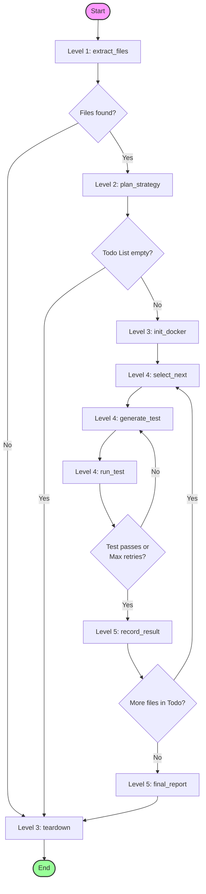
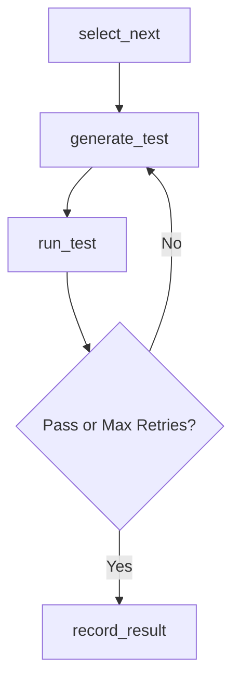

# QA Agent: Node Specifications and Workflow Flow

This document details the **LangGraph nodes** required to build the Autonomous QA Agent, organized by their respective **Implementation Levels**. It defines their file paths, responsibilities, input/output schemas from `QAState`, and transition rules.

For state structure details, see [src/workflow/state.py](file:///c:/Users/Pawan/Desktop/qa-agents/src/workflow/state.py). For styling and formatting guidelines, see [docs/rule.md](file:///c:/Users/Pawan/Desktop/qa-agents/docs/rule.md).

---

## Workflow Overview

The QA Agent runs as an orchestrated state machine. The execution flows sequentially from file discovery and strategy planning, through environment setup, into a cyclic worker loop that generates and self-heals tests, and finally to report generation and sandbox teardown.



---

## Implementation Levels and Node Details

### Level 1: Minimal Pipeline (File Discovery)

Level 1 focuses on finding JavaScript or TypeScript files matching configuration criteria within the user-specified target path.

#### 1. `extract_files`
* **File Path:** [extract_files.py](file:///c:/Users/Pawan/Desktop/qa-agents/src/workflow/nodes/extract_files.py)
* **Goal:** Scan the target project path and extract all valid source files for test candidates.
* **State Interaction:**
  * **Reads:** `target_path`, `input_type`, `project_language`
  * **Writes:** `discovered_files`
* **Behavior:**
  1. Retrieve language configurations (valid extensions and default ignore patterns) via `get_language_config(project_language)`.
  2. Parse the target project directory, respecting `.gitignore` files and language-specific excludes.
  3. Populate the state's `discovered_files` list with project-relative paths.
* **Transition:** Always goes to the router `route_after_extract`.
  * **Router (`route_after_extract`):** 
    * If `discovered_files` is empty $\rightarrow$ Route directly to `teardown` (skip execution).
    * If `discovered_files` has items $\rightarrow$ Route to `plan_strategy`.

---

### Level 2: Intelligent Planning

Level 2 introduces the LLM-driven planning phase. It determines which files are testable, details their import dependencies, and schedules the execution order.

#### 2. `plan_strategy`
* **File Path:** [plan_strategy.py](file:///c:/Users/Pawan/Desktop/qa-agents/src/workflow/nodes/plan_strategy.py)
* **Goal:** Filter out non-testable files, construct a dependency graph, and create a prioritized queue of source files to test.
* **State Interaction:**
  * **Reads:** `discovered_files`, `target_path`, `project_language`
  * **Writes:** `excluded_files`, `dependency_graph`, `todo_list`
* **Behavior:**
  1. Prepare a prompt with file paths and lightweight structures (avoid sending entire source contents to conserve tokens).
  2. Query the LLM using `.with_structured_output(PlanStrategyOutput)` to obtain:
     * `test_candidates`: List of testable source files.
     * `excluded_files`: Map of excluded files and reasons (e.g., config files, types-only files, barrel exports).
     * `dependency_graph`: Mapping of each file to its local project dependencies.
     * `todo_list`: Priority-sorted execution list starting from the foundational modules (leaves) and moving up to importer modules.
* **Transition:** Always goes to the router `route_after_plan`.
  * **Router (`route_after_plan`):**
    * If `todo_list` is empty $\rightarrow$ Route directly to `teardown` (nothing to test).
    * If `todo_list` has items $\rightarrow$ Route to `init_docker`.

---

### Level 3: Sandbox Setup (Persistent Container)

Level 3 establishes the persistent execution environment using Docker. It runs a single container that stays active throughout the entire workflow execution.

#### 3. `init_docker`
* **File Path:** [init_docker.py](file:///c:/Users/Pawan/Desktop/qa-agents/src/workflow/nodes/init_docker.py)
* **Goal:** Launch a persistent container, prepare the workspace structure, and run standard setup commands (`npm install`).
* **State Interaction:**
  * **Reads:** `target_path`, `input_type`, `project_language`
  * **Writes:** `workspace_root`, `sandbox_ready`, `container_id`
* **Behavior:**
  1. Instantiate the sandbox manager via `create_sandbox()`.
  2. Setup a temporary workspace directory on the host machine (`workspace_root`).
  3. Mirror or lay flat the source files into the workspace based on the project configuration.
  4. Write configuration files (`package.json`, `jest.config.js`, `tsconfig.json` if TypeScript).
  5. Start the Docker container (using the image from language config, e.g. `node:20-alpine`), mounting the host workspace volume to `/workspace`.
  6. Execute `npm install` inside the container to prepare node modules.
* **Transition:** Route directly to `select_next`.

---

### Level 4: Active File Worker Loop

Level 4 is the core execution loop. It iterates over files in the `todo_list`, invoking the LLM to generate or fix tests, running them in the sandbox, and handling retries if failures occur.



#### 4. `select_next`
* **File Path:** [select_next.py](file:///c:/Users/Pawan/Desktop/qa-agents/src/workflow/nodes/select_next.py)
* **Goal:** Pop the next file from the queue and set it as the active context.
* **State Interaction:**
  * **Reads:** `todo_list`, `target_path`, `workspace_root`
  * **Writes:** `todo_list`, `current_file`, `current_source_code`, `current_language`, `generated_test_code`, `test_passed`, `test_output`, `retries`
* **Behavior:**
  1. Pop the first file path from `todo_list` queue.
  2. Read the source code from the file path and set `current_source_code`.
  3. Determine and set `current_language`.
  4. Reset loop variables:
     * `generated_test_code` = `None`
     * `test_passed` = `False`
     * `test_output` = `None`
     * `retries` = `0`
* **Transition:** Route directly to `generate_test`.

#### 5. `generate_test`
* **File Path:** [generate_test.py](file:///c:/Users/Pawan/Desktop/qa-agents/src/workflow/nodes/generate_test.py)
* **Goal:** Create a new Jest unit test suite or fix a failing test suite using error feedback.
* **State Interaction:**
  * **Reads:** `current_file`, `current_source_code`, `current_language`, `generated_test_code`, `test_output`, `retries`, `max_retries`
  * **Writes:** `generated_test_code`
* **Behavior:**
  1. If `retries` is `0` (initial generation):
     * Construct the generation prompt using the source code and import requirements (importing from `@jest/globals` and importing the file under test with the correct relative path).
  2. If `retries` > `0` (self-healing):
     * Construct the repair prompt containing the source code, the previous test code, and the failing Jest output (`test_output`).
  3. Call `get_llm()` to run the prompt and retrieve the test code.
  4. Clean the response (removing markdown backticks or markdown language specifiers).
* **Transition:** Route directly to `run_test`.

#### 6. `run_test`
* **File Path:** [run_test.py](file:///c:/Users/Pawan/Desktop/qa-agents/src/workflow/nodes/run_test.py)
* **Goal:** Save the test file to the mounted workspace and run the Jest execution command in the running container.
* **State Interaction:**
  * **Reads:** `workspace_root`, `container_id`, `current_file`, `generated_test_code`, `project_language`
  * **Writes:** `test_passed`, `test_output`
* **Behavior:**
  1. Save the contents of `generated_test_code` into the test folder in the mounted `workspace_root` (using the language-specific naming convention, e.g. `{name}.test.js` or `{name}.test.ts`).
  2. Execute the test command (`npx jest --json 2>&1`) inside the running sandbox container using `docker exec` API.
  3. Parse the execution results. Set `test_passed` (`True` if exit code is 0, `False` otherwise) and store stdout/stderr in `test_output`.
* **Transition:** Always goes to the router `route_after_run_test`.
  * **Router (`route_after_run_test`):**
    * If `test_passed` is `True` or `retries` $\ge$ `max_retries` $\rightarrow$ Route to `record_result`.
    * If `test_passed` is `False` and `retries` < `max_retries` $\rightarrow$ Increment `retries` by 1 and route back to `generate_test`.

---

### Level 5: Recording and Reporting

Level 5 aggregates the completed work, formats user summaries, and cleans up docker resources.

#### 7. `record_result`
* **File Path:** [record_result.py](file:///c:/Users/Pawan/Desktop/qa-agents/src/workflow/nodes/record_result.py)
* **Goal:** Log the execution result of the active file to the global run ledger.
* **State Interaction:**
  * **Reads:** `current_file`, `test_passed`, `retries`, `test_output`
  * **Writes:** `file_statuses`
* **Behavior:**
  1. Determine the status classification: `completed` if `test_passed` is true, otherwise `failed`.
  2. Formulate a `FileStatus` record:
     ```python
     FileStatus(
         status="completed" if test_passed else "failed",
         passed=test_passed,
         retries_used=retries,
         test_file_path=str(test_file_path),
         error_log=None if test_passed else test_output
     )
     ```
  3. Merge this record into `file_statuses` using the relative file path as the key.
* **Transition:** Always goes to the router `route_after_record`.
  * **Router (`route_after_record`):**
    * If `todo_list` is not empty $\rightarrow$ Route back to `select_next` to continue testing.
    * If `todo_list` is empty $\rightarrow$ Route to `final_report`.

#### 8. `final_report`
* **File Path:** [final_report.py](file:///c:/Users/Pawan/Desktop/qa-agents/src/workflow/nodes/final_report.py)
* **Goal:** Generate a markdown report and terminal summary containing statistics of the run.
* **State Interaction:**
  * **Reads:** `file_statuses`, `excluded_files`
  * **Writes:** `final_report`
* **Behavior:**
  1. Gather totals: overall files processed, success count, failure count, total retries.
  2. Build a markdown document summarizing which files passed, which failed, and lists of files excluded.
  3. Print the execution table to the console using Rich panels/tables.
* **Transition:** Route directly to `teardown`.

#### 9. `teardown`
* **File Path:** [teardown.py](file:///c:/Users/Pawan/Desktop/qa-agents/src/workflow/nodes/teardown.py)
* **Goal:** Terminate the persistent Docker container and clean up host workspace directories.
* **State Interaction:**
  * **Reads:** `container_id`, `workspace_root`
  * **Writes:** `sandbox_ready`, `container_id`
* **Behavior:**
  1. If `container_id` is present, stop and forcefully remove the container to avoid resource leaks.
  2. Delete the temporary directory on the host workspace.
  3. Reset `sandbox_ready` to `False` and `container_id` to `None`.
* **Transition:** Route to `END`.

---

## Summary of State Keys Read/Written

The table below describes the direct read/write mapping per node to help guide variable passing in LangGraph node development:

| Level | Node | Reads from State | Writes to State |
|---|---|---|---|
| **L1** | `extract_files` | `target_path`, `input_type`, `project_language` | `discovered_files` |
| **L2** | `plan_strategy` | `discovered_files`, `target_path`, `project_language` | `excluded_files`, `dependency_graph`, `todo_list` |
| **L3** | `init_docker` | `target_path`, `input_type`, `project_language` | `workspace_root`, `sandbox_ready`, `container_id` |
| **L4** | `select_next` | `todo_list`, `target_path`, `workspace_root` | `todo_list`, `current_file`, `current_source_code`, `current_language`, `generated_test_code`, `test_passed`, `test_output`, `retries` |
| **L4** | `generate_test` | `current_file`, `current_source_code`, `current_language`, `generated_test_code`, `test_output`, `retries`, `max_retries` | `generated_test_code` |
| **L4** | `run_test` | `workspace_root`, `container_id`, `current_file`, `generated_test_code`, `project_language` | `test_passed`, `test_output` |
| **L5** | `record_result` | `current_file`, `test_passed`, `retries`, `test_output` | `file_statuses` |
| **L5** | `final_report` | `file_statuses`, `excluded_files` | `final_report` |
| **L3/5**| `teardown` | `container_id`, `workspace_root` | `sandbox_ready`, `container_id` |
